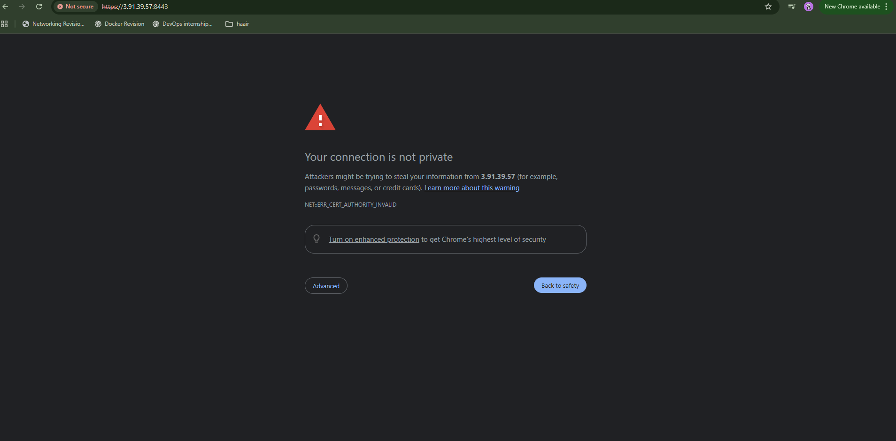
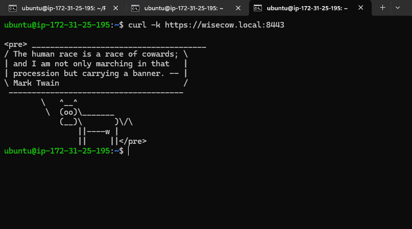
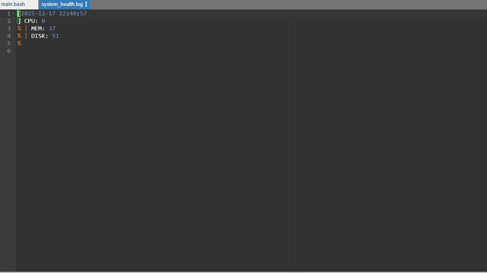
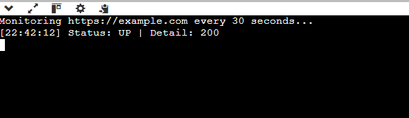

# Wisecow Application

## Overview

Wisecow is a simple Bash-based web application that displays a random fortune using `cowsay`.  
This project demonstrates:

- Docker containerization
- Kubernetes deployment (Kind cluster on EC2)
- Secure TLS communication via NGINX Ingress
- CI/CD using GitHub Actions

---

## Repository Structure

wisecow/
├── wisecow.sh
├── Dockerfile
├── deployment.yaml
├── service.yaml
├── ingress.yaml
├── .github/workflows/ci-cd.yml
└── README.md


All Kubernetes manifests are in the root directory.

---

## Prerequisites

- Docker installed on your local machine or EC2
- Kind cluster running
- Bash, cowsay, fortune (installed in Docker image)
- GitHub repository with secrets configured (Docker Hub)

---

## Dockerization

Dockerfile build

Docker image is pushed to Docker Hub:
```
unicron28/wisecow:latest
```

## Kubernetes Deployment

Deployment: Runs Wisecow container
Service: Exposes the app on port 4499
Ingress: Provides HTTPS access with TLS
TLS is handled with a self-signed certificate. Browser shows a security warning which confirms HTTPS.

## CI/CD Pipeline

GitHub Actions workflow performs:
  1. Checkout repository
  2. Docker login
  3. Build Docker image using Buildx and QEMU
  4. Push image to Docker Hub
  5. Deploy to Kubernetes cluster (self-hosted runner on EC2)

Secrets used:
```
DOCKERHUB_USERNAME
DOCKERHUB_TOKEN
```
## Accessing Wisecow

Open browser:
```
https://<EC2-PUBLIC-IP>:9000
```

You will see a security warning (self-signed TLS)
Proceed anyway → application loads with cow + fortune

Terminal alternative:
```
curl -k https://<EC2-PUBLIC-IP>:8443
```

## Screenshots

### 1. GitHub Actions workflow


### 2. Browser TLS warning


### 3. Wisecow app running over HTTPS


### 3. Wisecow app running over Terminal



## Problem Statement 2.1

###How To Run :
```
chmod +x system_health_monitor.sh
./system_health_monitor.sh
```
### Output : 


## Problem Statement 2.2

###How To Run:
Install Dependencies

### Output :



